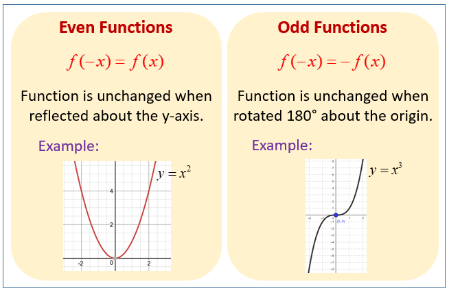
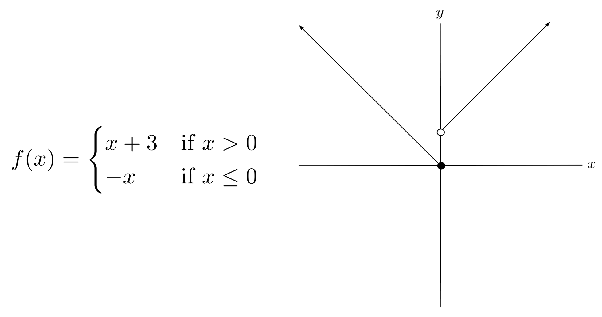
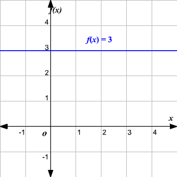
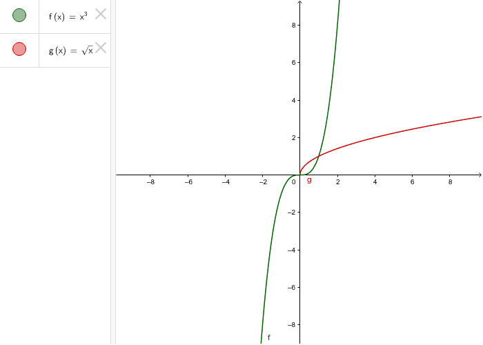
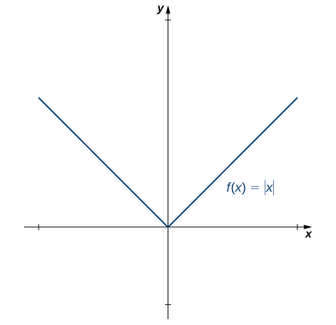

## Pre-Calc

### Important Math Notations/Definitions

**Inclusive set** [ ] <br>
**Exclusive set** ( ) - always used with $\infty$<br>
**Domain:** Set of inputs of a function that give a **real** number output, square roots need to be positive.<br>
**Range:** Set of outputs

### Intro to Functions
A function is a relationship that maps **one input** ($x$ values) to **one output** ($y$ or $f(x)$ values). An input **never** gives more than 1 output.

> **Example 1:** two inputs share one output - still a function

| Work Hours |   | Pay |
|-----------:|:-:|----:|
| 2 hrs      | → | $30 |
| 4 hrs      | → | $60 |
| 6 hrs      | → | $90 |
| 8 hrs      | → | $90 |  

$S = \set{(-2, 16), (-1,4), (0,3)}$<br>
$y = -7x +5$<br>
$y= 2x^2 -5x +4$<br>

> **Example 2:** one input has two outputs - not a function

| Work Hours |   | Pay |
|-----------:|:-:|----:|
| 2 hrs      | → | $30 |
| 4 hrs      | → | $60 |
| 4 hrs      | → | $90 |

$R = \set{(-2, 16), (-1,4), (-2,16)}$<br>
$y = \pm\sqrt{3-2x}$

### Finding Domain

Domains of root functions carries through operations. Always find domain of function before operations.

> **Example 1:** Finding solution to equality

$f(x) = \sqrt{5-4x}$<br>$5-4x \ge 0$<br>$x \ge \frac{5}{4}$<br>

Domain = $\set{x \mid x \le \frac{5}{4}}$

> **Example 2:** Denominators can never equal 0

$g(t) = \frac{5t}{t^3 -16t}$<br>$t^3 - 16t = 0$<br>$t(t^2 -16) = 0$<br>$t(t-4)(t+4) = 0$<br>

$D:\{\, t \mid t\in\mathbb{R}, t \neq -4, t \neq 0, t \neq 4\,\}$<br>
$(-\infty, -4) \cup (-4, 0) \cup (0, 4) \cup (4, \infty)$

> **Example 3:** Vertical line test
 
<svg xmlns="http://www.w3.org/2000/svg" style="max-width:100%;max-height:162px;" xmlns:xlink="http://www.w3.org/1999/xlink" version="1.1" width="162px" viewBox="-0.5 -0.5 162 162"><defs><style type="text/css">@import url(https://fonts.googleapis.com/css2?family=Architects+Daughter:wght@400;500);
</style></defs><g><g><path d="M 1 81 L 161 81" fill="none" stroke="#000000" stroke-opacity="0.4" stroke-width="2" stroke-miterlimit="10" transform="rotate(-90,81,81)" pointer-events="all" style="stroke: light-dark(rgb(0, 0, 0), rgb(255, 255, 255));"/></g><g><path d="M 1 86 L 161 86" fill="none" stroke="#000000" stroke-opacity="0.3" stroke-width="2" stroke-miterlimit="10" pointer-events="all" style="stroke: light-dark(rgb(0, 0, 0), rgb(255, 255, 255));"/></g><g><path d="M 1 146 Q 91 136 106 111 Q 121 86 91 86 Q 61 86 66 61 Q 71 36 152.81 26.91" fill="none" stroke="#000000" stroke-width="2" stroke-miterlimit="10" pointer-events="stroke" style="stroke: light-dark(rgb(0, 0, 0), rgb(255, 255, 255));"/><path d="M 158.78 26.25 L 151.27 31.11 L 152.81 26.91 L 150.38 23.15 Z" fill="#000000" stroke="#000000" stroke-width="2" stroke-miterlimit="10" pointer-events="all" style="fill: light-dark(rgb(0, 0, 0), rgb(255, 255, 255)); stroke: light-dark(rgb(0, 0, 0), rgb(255, 255, 255));"/></g><g><path d="M 21 81 L 181 81" fill="none" stroke="#b85450" stroke-width="2" stroke-miterlimit="10" transform="rotate(-90,101,81)" pointer-events="all" style="stroke: light-dark(rgb(184, 84, 80), rgb(215, 129, 126));"/></g></g></svg>

<!-- Vertical-line test: parabola & test line -->

<svg width="300" height="180" viewBox="0 0 300 180"
     xmlns="http://www.w3.org/2000/svg" stroke-width="2" fill="none">

  <!-- parabola y = x² shifted/scaled to fit -->
  <path d="M 0 150 Q 150 0 300 150" stroke="#0645AD"/>
  
  <!-- vertical test line -->
  <line x1="200" y1="10" x2="200" y2="170" stroke="crimson"/>
</svg>


**Even function** symmetric about the y-axis <br>
$f(x) = f(-x)$

**Odd function** Symmetric about the origin - totate 180 and fold twice over y then x <br>
$-f(x) = f(-x)$



**Increasing** $x_1 < x_2$ for $f(x_1) < f(x_2)$ <br>
**Decreasing** $ x_1 < x_2$ for $f(x_1) > f(x_2)$<br>
**Local/Relative Max** On an open interval $f(x) \le f(c)$ where $c$ is a local max. Function changes from increasing to decreasing. Cannot ocur at an endpoint.<br>
**Local/Relative Min** $f(x) \ge f(c)$ where $c$ is a local min. Function changes from decreasing to increasing. Cannot occur at an endpoint. <br>
**Absolute Max** Highest output of the function. Can occur at endpoints<br>
**Absolute Min** Lowest output of the function. Can occur at endpoints.<br>
**Average rate of change** $\frac{f(b) - f(a)}{b-a}$<br>
> **Example** Find Average rate of change of $f(x) = x^2 - 2x$ from $x = 3$ to $x=5$<br>
$f(3) = 9-6 = 3$<br>
$f(5) = 25-10 = 15$<br>
Average rate of change $ \frac{15 -3}{5-3} = \frac{12}{2} = 6$
**Equation of a line** $y -y_1 = m(x-x_1)$<br>
**Piece-wise functions**<br>


**Popular graphs**<br>
$f(x) = 3$ <br>
<br>
$f(x) = x$<br>
<br>
$f(x) = \sqrt[3]{x}$
<br>
$f(x) = \abs{x}$
<br>

<!-- Simple vertical-line test diagram -->
<svg width="220" height="220" viewBox="-11 -11 22 22">
  <!-- Axes -->
  <line x1="-10" y1="0"  x2="10" y2="0"  stroke="#888" stroke-width="0.2"/>
  <line x1="0"  y1="-10" x2="0" y2="10" stroke="#888" stroke-width="0.2"/>

  <!-- Example curve (half of a sideways parabola) -->
  <path d="M -9 9 Q -4 0 1 9" fill="none" stroke="#0645AD" stroke-width="0.4"/>

  <!-- Vertical test line  -->
  <line x1="-3" y1="-10" x2="-3" y2="10" stroke="crimson" stroke-width="0.4"/>

  <!-- Optional annotation -->
  <text x="-3" y="-10.5" font-size="0.8" text-anchor="middle" fill="crimson">x = −3</text>
</svg>

## Domain → Codomain (Vertical-Line Test)

```mermaid
graph TD
  x1[(−3)] --> y1[(5)]
  x2[(−3)] --> y2[(−5)]
